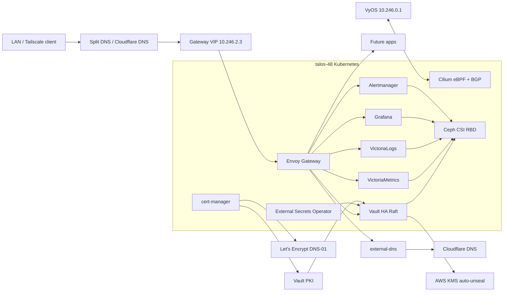

# Kubernetes Platform Notes

Public, secret-free documentation for the `talos-48` Kubernetes platform.

This repository is intentionally documentation-only. It summarizes the platform
architecture, design decisions, and implementation status without storing
secrets, kubeconfigs, recovery keys, private tokens, or raw machine
configuration.

## Goal

Build a production-style Kubernetes platform for private infrastructure using
immutable Talos nodes, GitOps, Cilium eBPF networking, BGP-advertised ingress,
Vault-backed secret management, persistent storage, and a complete
observability stack.

The platform is designed to replace an older Rancher/RKE2 cluster gradually
without forcing every application to be migrated at once.

## talos-48

- Domain: `48.network`
- Kubernetes API VIP: `10.246.0.80`
- Control plane nodes: `10.246.0.81-10.246.0.83`
- Worker nodes: `10.246.0.84-10.246.0.87`
- CNI: Cilium with eBPF kube-proxy replacement
- Router/BGP peer: VyOS `10.246.0.1`
- LoadBalancer pool: `10.246.2.2-10.246.2.14`
- Active Talos Gateway VIP: `10.246.2.3`
- Public Vault endpoint: `https://vault.48.network`
- Private observability endpoints: `https://grafana.48.network`, `https://logs.48.network`, `https://metrics.48.network`, `https://alertmanager.48.network`

`10.246.2.2` remains assigned to the older RKE2 cluster during migration. The
Talos cluster uses `10.246.2.3` to avoid both clusters advertising the same
BGP route.

## GitOps Layout

- `talos-48`: Talos machine configuration and encrypted recovery material.
- `talos-platform-gitops`: Flux-managed platform components.
- `talos-apps-gitops`: Application workloads after the platform is stable.
- `k8s`: public documentation and diagrams only.

## Implemented Capabilities

- Immutable Talos control plane with three control-plane nodes and four workers.
- Static node addressing, API VIP, and split DNS under `48.network`.
- Cilium eBPF kube-proxy replacement with no flannel and no kube-proxy pods.
- Cilium BGP peering with VyOS for Kubernetes LoadBalancer/Gateway VIPs.
- Envoy Gateway as the private ingress layer for platform services.
- cert-manager for certificate lifecycle automation.
- Let's Encrypt DNS-01 for browser-trusted private routes.
- Vault HA Raft with AWS KMS auto-unseal and persistent Ceph RBD volumes.
- External Secrets Operator reading Vault over HTTPS.
- Vault PKI integrated with cert-manager for internal certificate issuance.
- Cloudflare external-dns with an explicit `external-dns=public` label gate.
- VictoriaMetrics, VictoriaLogs, Grafana, and Alertmanager for observability.
- Grafana GitHub OAuth and PostgreSQL-backed state.
- Alertmanager Slack routing through a Vault-managed webhook.
- Talos control-plane, kubelet, Cilium, node-exporter, and platform metrics scraping.

## TLS and PKI

Use cert-manager for Kubernetes certificate automation and Vault PKI as the
internal certificate authority.

cert-manager handles:

- watching `Certificate` resources
- requesting and renewing certificates
- storing TLS material as Kubernetes `Secret` objects
- making certificates easy for Gateway API and applications to consume

Vault PKI handles:

- internal CA and intermediate CA management
- certificate signing policy
- trust roots for private services
- future workload identity and mTLS use cases

Recommended model:

```text
Gateway or app needs TLS
        |
        v
cert-manager Certificate
        |
        v
Vault-backed Issuer or ClusterIssuer
        |
        v
Vault PKI signs the certificate
        |
        v
cert-manager writes a Kubernetes TLS Secret
        |
        v
Envoy Gateway or the app consumes the Secret
```

Use Vault PKI for internal `48.network` services. Use public ACME, such as
Let's Encrypt with Cloudflare DNS-01, only for names that require public browser
trust without installing the internal CA.

## Current Platform

The Talos cluster currently has the base platform online:

- Flux GitOps
- Cilium with eBPF kube-proxy replacement
- Cilium BGP and LB IPAM
- Envoy Gateway on `10.246.2.3`
- cert-manager with Let's Encrypt DNS-01
- Ceph CSI RBD storage
- Vault HA Raft with AWS KMS auto-unseal
- External Secrets Operator reading Vault over HTTPS
- Vault PKI exposed to cert-manager through the `vault-internal` ClusterIssuer
- external-dns for explicitly labeled public Cloudflare records
- VictoriaMetrics and VictoriaLogs for metrics and logs

## Security Model

- Raw Talos machine configs, `kubeconfig`, and `talosconfig` are kept out of
  public documentation and private Git in plaintext.
- Durable Talos bootstrap material is stored in the private `talos-48`
  repository with SOPS + age encryption.
- Vault recovery keys and root token are stored outside Git.
- Kubernetes consumes application and platform secrets through External Secrets
  Operator rather than committing Kubernetes `Secret` manifests with plaintext
  values.
- Public DNS automation is opt-in per HTTPRoute through the
  `external-dns=public` label.
- Private observability routes use split DNS and are not published by
  external-dns.

Vault traffic is encrypted end to end:

```text
client -> HTTPS vault.48.network:443 -> Envoy Gateway -> HTTPS vault-active.vault.svc:8200 -> Vault
```

Vault PKI is available for internal certificate automation. Kubernetes
resources remain GitOps-managed, while Vault API configuration can later be
managed with Terraform.

external-dns is installed but intentionally conservative: it watches Gateway
HTTPRoutes for `48.network` and only manages routes labeled
`external-dns=public`.

Observability is private-only through split DNS to `10.246.2.3`:

- Grafana: `https://grafana.48.network`
- VictoriaLogs: `https://logs.48.network`
- VictoriaMetrics: `https://metrics.48.network`
- Alertmanager: `https://alertmanager.48.network`

The observability routes use Let's Encrypt DNS-01 certificates for browser
trust, but they are not labeled for public DNS automation.

Current validation:

- All seven Kubernetes nodes are `Ready`.
- Flux and all platform Helm releases are `Ready`.
- No pods are pending or crash-looping.
- VictoriaMetrics reports zero down scrape targets.
- Grafana login redirects to GitHub OAuth.
- Alertmanager loads the Slack receiver configuration from Vault.

## Operations Roadmap

The base platform is complete. Remaining work is intentionally separated from
application migration:

- Move manually bootstrapped Vault API configuration into Terraform.
- Add backup and restore runbooks for Vault, Grafana PostgreSQL state,
  VictoriaMetrics, VictoriaLogs, and Ceph-backed platform volumes.
- Add upgrade runbooks for Talos, Kubernetes, Cilium, Flux, and platform Helm
  charts.
- Bootstrap `talos-apps-gitops` when application migration starts.

## Architecture


